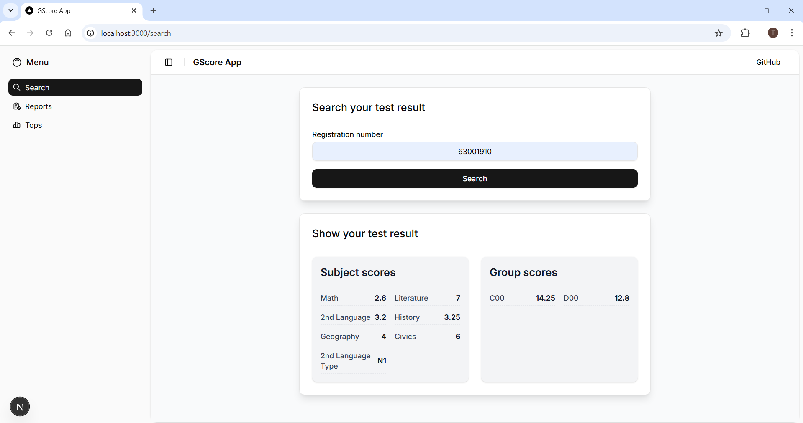
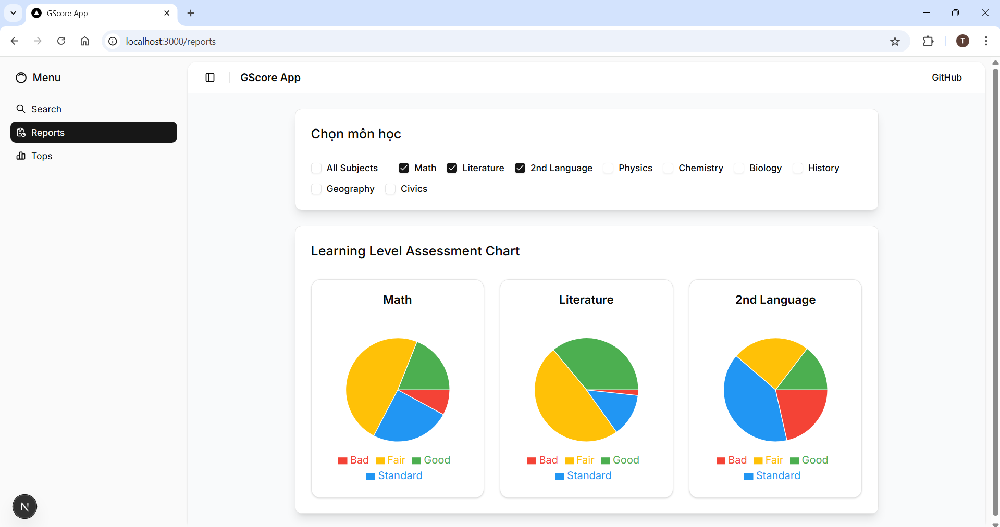
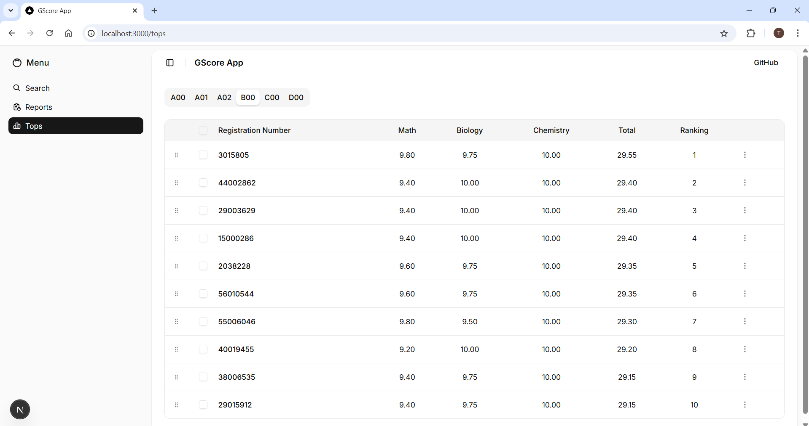

# GScore App

### Score Search Page

### Level Report Page

### Top Student Page

How to run the font-end app locally
- `cd frontend`
- `npm run dev` or `yarn dev`

How to run the backend-end app locally
- `cd backend`
- `npm run dev` or `yarn dev`

Notice:
- Should use `20.18.1` to run seamlessly
